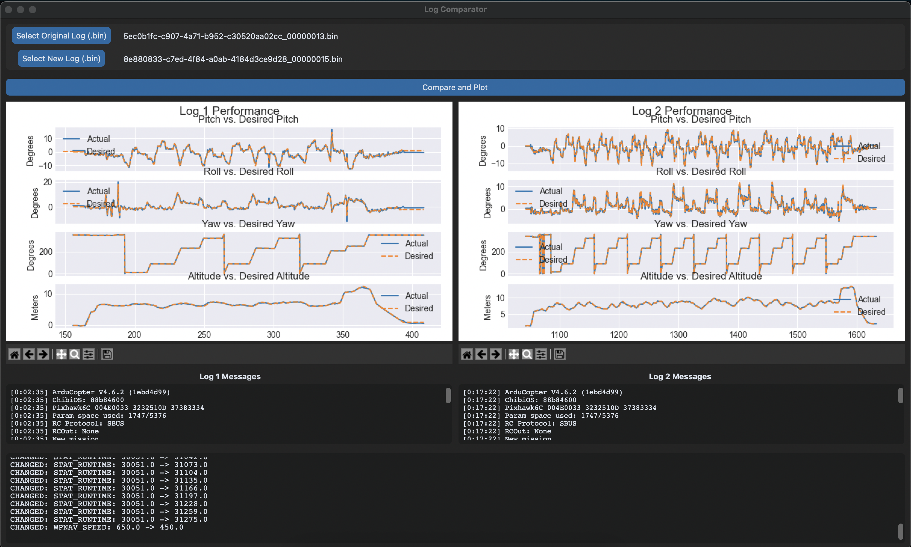

# ArduPilot Log Comparison Tool

This is a Python GUI application built to analyze and compare ArduPilot `.bin` flight logs. It is designed for flight testers and developers who need to quickly see how parameter changes affect flight performance.

The tool loads two log files, automatically finds all changed parameters, and displays side-by-side performance plots and messages.



---

## Features

* **File Upload:** Load two ArduPilot `.bin` logs from your computer.
* **Parameter Comparison:** Automatically diffs all parameters between the two logs and displays a clean list of changes (Added, Removed, Changed).
* **Side-by-Side Plots:** Displays performance for Log 1 and Log 2 in separate, side-by-side columns.
* **Interactive Graphs:** Plots are fully interactive with zoom, pan, and save controls (via Matplotlib's navigation toolbar).
* **Key Metrics Plotted:**
    * Pitch vs. Desired Pitch
    * Roll vs. Desired Roll
    * Yaw vs. Desired Yaw
    * Altitude vs. Desired Altitude
* **Message Display:** Shows a timestamped list of all `MSG` (messages) from each log for easy review.

---

## Dependencies

This program requires the following components:

### 1. Python
* **Python 3.10+**: A modern version of Python is required. Using the official installer from [python.org](https://www.python.org/) is **highly recommended**, as it includes the necessary Tcl/Tk libraries for the GUI.

### 2. External Tool
* **MAVProxy / Pymavlink**: This provides the `mavlogdump.py` utility, which is essential for parsing the binary `.bin` log files.

### 3. Python Packages
The following packages will be installed via `pip`:
* `customtkinter`: For the modern GUI.
* `pandas`: For data handling and merging.
* `matplotlib`: For plotting.
* `pymavlink`: The core library for MAVLink communication and log parsing.
* `mavproxy`: The suite that includes the `mavlogdump.py` tool.

---

## Installation

Follow these steps in your terminal to set up the project:

1.  **Clone or download the repository:**
    ```bash
    git clone https://github.com/ZeynepB5793/ardupilot-log-compare
    cd ardupilot-log-compare
    ```

2.  **Create a virtual environment:**
    ```bash
    python3 -m venv venv
    ```

3.  **Activate the virtual environment:**
    ```bash
    source venv/bin/activate
    ```
    *(Your terminal prompt should now show `(venv)`)*

4.  **Install all required libraries:**
    This single command will install all the necessary dependencies listed above.
    ```bash
    pip install customtkinter pandas matplotlib pymavlink mavproxy
    ```

---

## How to Use

1.  **Activate the environment** (if not already active):
    ```bash
    source venv/bin/activate
    ```

2.  **Run the application:**
    ```bash
    python3 gui_compare.py 
    ```

3.  Click **'Select Original Log (.bin)'** to upload your baseline file.
4.  Click **'Select New Log (.bin)'** to upload the log with changes.
5.  Click the **'Compare and Plot'** button.
6.  The app will process the logs (which may take a few seconds) and then display the plots, messages, and parameter changes.

---

